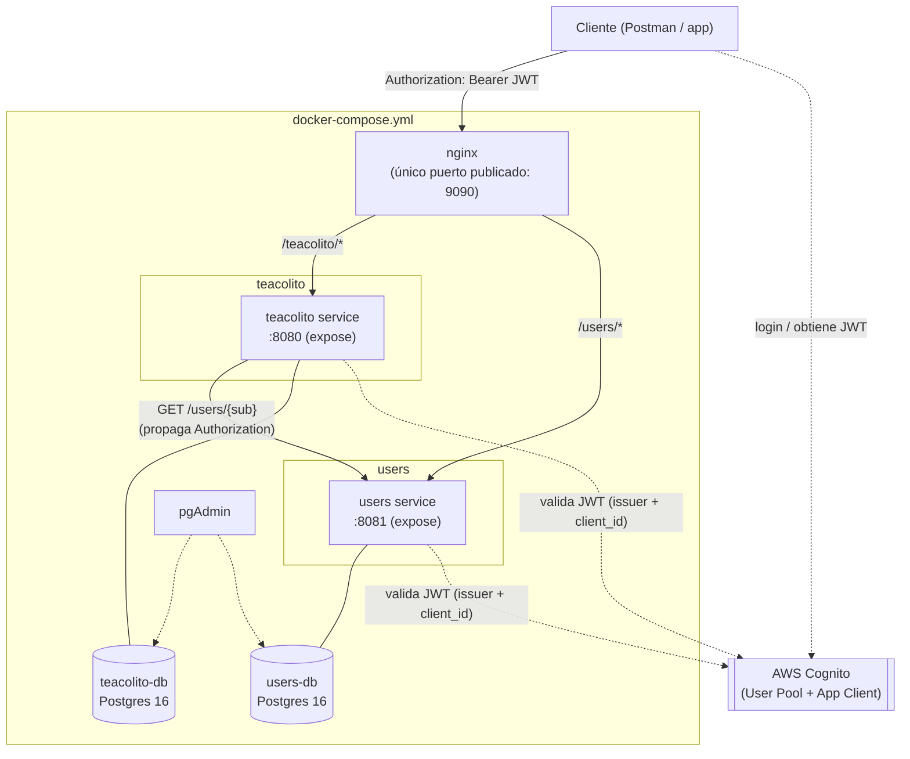

# TeAcolito — Proyecto Integrador de Arquitectura Empresarial

- **Integrantes**: Steven Joel Jácome Yandún, Isaac Alejandro Calero Garzón
- **NRC**: 1462
- **Periodo**: 2026-01
- **Proyecto**: TeAcolito — API de gastos compartidos entre grupos de personas (estilo "Splitwise")
- **URL desplegada**: no aplica — la entrega de esta materia se demuestra localmente con `docker compose up -d` (ver sección "Cómo levantar el proyecto")

## Alcance del sistema

Monorepo con tres componentes detrás de un único punto de entrada (nginx):

| Componente | Responsabilidad | Base de datos propia |
|---|---|---|
| `users/` | Resuelve `sub` de Cognito → `displayName` del usuario | `users-db` (Postgres) |
| `teacolito/` | Grupos de gasto, miembros, gastos, balances, netting, liquidaciones | `teacolito-db` (Postgres) |
| `nginx/` | API Gateway / reverse proxy — único servicio con puerto publicado al host | — |

Ningún microservicio consulta la base de datos del otro: `teacolito` resuelve `displayName` llamando a la API de `users` (propagando el token), nunca por SQL cruzado.

## Diagrama de arquitectura



## Cómo levantar el proyecto

1. Clonar el repositorio y copiar `.env.example` a `.env`, completando los valores reales de Cognito (región, user pool id, issuer, app client id).
2. Tener Docker y Docker Compose instalados.
3. Desde la raíz del repo:
   ```bash
   docker compose up -d
   ```
4. Verificar que todo quedó `healthy`:
   ```bash
   docker compose ps
   ```
5. La API queda expuesta **únicamente** a través de nginx en `http://localhost:9090` (`/teacolito/...`, `/users/...`). Los puertos internos de los microservicios y de las bases no son accesibles desde el host.
6. Explorador de base de datos: pgAdmin corre como servicio del compose, con ambas conexiones (`teacolito-db`, `users-db`) ya registradas (ver `pgadmin/servers.json`).
7. Logs en vivo de todo el sistema:
   ```bash
   docker compose logs -f
   ```

## Estructura del monorepo

```
├── users/          # Microservicio de perfiles de usuario (displayName)
├── teacolito/       # Microservicio de gastos compartidos (ver teacolito/README.md)
├── nginx/          # API Gateway — único punto de entrada
├── pgadmin/         # Conexiones pre-registradas al explorador de BD
├── docker-compose.yml
└── .env.example
```

## Microservicio `users`

Mismo stack que teacolito (Kotlin + Spring Boot 4 + Postgres + Flyway + Cognito resource server + logging estándar). Su única responsabilidad es resolver `sub` de Cognito → `displayName`, para que teacolito nunca muestre el ID crudo ni el correo.

- `POST /users` — crea el perfil del usuario autenticado (`sub` sale del JWT, nunca del body). `displayName` es **único globalmente** (no por usuario) — 409 si ya está en uso, 409 si el `sub` ya tiene perfil.
- `GET /users/{sub}` — resuelve el `displayName` de cualquier `sub` (lo consume `UserClient` en teacolito, llamando directo al servicio, sin pasar por nginx).
- Tests: unitarios (service) + integración (`@SpringBootTest` + Testcontainers Postgres), mismo patrón que teacolito.

## Estándar de logging

Todos los servicios (`users`, `teacolito`) escriben a **stdout** (lo que captura `docker compose logs -f`), en una sola línea por evento, con este formato fijo:

```
<timestamp> | <LEVEL> | <servicio> | sub=<cognito-sub|anonymous> | <logger> | msg=<mensaje>
```

Configuración (Logback, igual en ambos servicios):

```properties
logging.pattern.console=%d{yyyy-MM-dd'T'HH:mm:ss.SSSXXX} | %-5level | ${spring.application.name} | sub=%X{sub:-anonymous} | %logger{40} | %msg%n
```

- El **`sub`** se coloca en el MDC por un filtro propio (`RequestLoggingFilter`) que lo lee del JWT ya validado; si no hay token, se registra `sub=anonymous`.
- Cada request deja **línea de entrada** (`event=http.request`, método + ruta) y **línea de salida** (`event=http.response`, código HTTP + ruta) — implementado una sola vez por servicio en `RequestLoggingFilter`, no repartido en cada controller.
- Eventos de negocio en formato `<recurso>.<acción>` (`group.created`, `member.joined`, `expense.created`, `group.deleted`, `member.join.rejected`, etc.), emitidos desde la capa de `services`.
- SQL de Hibernate en `DEBUG` (`logging.level.org.hibernate.SQL`) y binding de parámetros en `TRACE` (`org.hibernate.orm.jdbc.bind`) en ambos `application.yml`.
- Las dos bases de datos (`teacolito-db`, `users-db`) corren con `log_statement=all`, `log_duration=on`, `log_min_duration_statement=0`, `log_connections=on`, `log_disconnections=on` (ver `docker-compose.yml`).
- No se loguean contraseñas, tokens completos ni datos personales sin enmascarar.

## Configuración de Cognito

- **Región**: `us-east-1`
- **User Pool ID**: `us-east-1_mNoOf1LKH`
- **App Client**: `teacolito`
- **Tipo de token validado**: Access Token (el `client_id` viaja en el claim `client_id`, no en `aud` — Cognito no pone el App Client en `aud` para Access Tokens, por eso `SecurityConfig.kt` valida `client_id` con un `OAuth2TokenValidator` propio en vez del validador de audience por defecto de Spring).
- **Grupos / roles**: no hay grupos de Cognito creados. El dominio tiene un solo rol (usuario autenticado); la autorización es contextual por recurso (ej. solo el creador de un grupo puede cerrarlo o eliminarlo, solo el dueño de un gasto puede editarlo, solo miembros del grupo pueden consultarlo), validada a mano en los `services`, no vía `@PreAuthorize` por rol. **Decisión de alcance confirmada con el profesor.**
- Los valores reales viven en `.env` (no versionado); `.env.example` documenta las claves sin secretos.

## Tests y cobertura (teacolito)

- **Unitarios** (JUnit 5 + Mockito): los 3 services (`ExpenseGroupService`, `ExpenseService`, `SettlementService`) y `CognitoClientIdValidator`.
- **Integración** (`@SpringBootTest` + `MockMvc` + Testcontainers Postgres): los 3 controllers, cubriendo caminos felices, errores de negocio (400/404/409) y autorización (401 sin token, 403 por no ser miembro/dueño del recurso). Incluye join por código, invitación privada, bloqueo de `DELETE` con balance pendiente, `ShareMismatchException`, y netting de extremo a extremo.
- **Excluido del objetivo de cobertura** (sin lógica propia que probar):
  - `TeacolitoApplication.kt` — clase de arranque, sin comportamiento.
  - `dto/*` — solo `data class` sin lógica.
  - `entities/*` — entidades JPA sin comportamiento más allá de sus campos.
  - `exceptions/*Exception.kt` — clases de una línea que solo extienden `RuntimeException`.
  - `SecurityConfig.kt` — configuración declarativa de Spring Security (DSL de beans), sin lógica propia; la única lógica real (`CognitoClientIdValidator`) sí tiene test unitario.
- Se corre con `./gradlew test` dentro de `teacolito/` (109 tests). Cobertura medida con el coverage del IDE (IntelliJ *Run with Coverage*, sobre `com.pucetec.teacolito`): **97% líneas, 97% métodos, 94% clases, 81% ramas**.
- **Huecos conocidos y por qué**:
  - `clients/UserClient` — solo se cubre la rama de fallback (falla la llamada → usa el username crudo) en los tests automatizados, porque en el entorno de test no hay un `users` real corriendo. La rama de éxito se verifica manualmente end-to-end (crear un perfil vía Postman y ver el `displayName` real en las respuestas de teacolito), pero no está cubierta por un test automatizado todavía.
  - `config/SecurityConfig.jwtDecoder()` — el bean real (que llama a Cognito por red al arrancar) está anotado `@Profile("!test")` a propósito y nunca se instancia en los tests; solo se prueba la lógica propia (`CognitoClientIdValidator`), no la llamada de red en sí.

### Tests y cobertura (users)

- **Unitarios** (`UserProfileServiceTest`): validación de nombre en blanco, perfil duplicado por `sub`, `displayName` duplicado, creación y consulta exitosa.
- **Integración** (`UserProfileControllerIntegrationTest`, Testcontainers Postgres): 401 sin token, 400 nombre en blanco, 201 creación, 409 perfil duplicado, 409 nombre ya tomado por otro `sub`, 404 perfil inexistente.
- 14 tests, `./gradlew test` dentro de `users/`.

## Colección de Postman (teacolito)

- Archivos: [`teacolito/teacolito.postman_collection.json`](teacolito/teacolito.postman_collection.json) + [`teacolito/teacolito.postman_environment.json`](teacolito/teacolito.postman_environment.json), versionados en el repo.
- `base_url` apunta a nginx (`http://localhost:9090`), no a un puerto interno — todas las rutas usan el prefijo `/teacolito/`.
- 4 carpetas en orden de ejecución: **Auth** (obtiene el Access Token real de Cognito vía `InitiateAuth` con `USER_PASSWORD_AUTH`, calcula `SECRET_HASH` si el App Client tiene secreto, maneja el challenge `NEW_PASSWORD_REQUIRED`, y crea el perfil de cada usuario en `users`) → **Expense Groups** → **Expenses** → **Settlements** → **Cleanup & group lifecycle**. 40 requests, cada uno con `pm.test`.
- Cubre join por código, invitación privada, `ShareMismatchException`, bloqueo de `DELETE` con balance pendiente, y casos explícitos de 400/404/409/401/403 — incluyendo 403 real usando dos usuarios de Cognito distintos (`user_a`/`user_b`).
- **Prerrequisitos para correrla completa**:
  - Dos usuarios reales del User Pool con `ALLOW_USER_PASSWORD_AUTH` habilitado en el App Client `teacolito`, con contraseña permanente (o resuelta vía el paso "Complete New Password Challenge"), configurados en el environment (`user_a_username`/`user_a_password`/`user_a_display_name`, ídem para `user_b`).
  - Si el App Client tiene un client secret configurado (como el nuestro), pegar ese valor en `cognito_client_secret` — la colección calcula el `SECRET_HASH` automáticamente con `crypto-js` (incluido en el sandbox de Postman, no requiere instalar nada).

## Estado y pendientes conocidos

Para ser honestos ante el profesor si se pregunta qué falta:

- **Auditoría de negocio** (quién/qué/cuándo a nivel de datos, ej. "Isaac editó el gasto 17 el día X") no está implementada como tabla o log dedicado. Se usa como respaldo el historial de commits de git (`git log`), que sí tiene aportes reales de ambos integrantes.
- **Autorización por roles de Cognito**: no se crearon grupos ni se usa `@PreAuthorize` por rol — la autorización es por dueño del recurso (ver sección Cognito arriba). Decisión de alcance confirmada con el profesor.
- **Cobertura de tests**: 97% en teacolito (no 100%), con los huecos documentados arriba.
- Sin colección Postman separada para `users` — sus endpoints se ejercitan indirectamente dentro de la carpeta "Auth" de la colección de teacolito.

## Antes de la entrega (pendiente de acción manual, no de código)

- [ ] Adjuntar aquí (o en el aula virtual) la captura del reporte de cobertura del IDE para `teacolito` y `users`.
- [ ] Confirmar que el repositorio de GitHub es accesible para el docente (público, o privado con el docente agregado como colaborador).
- [ ] Ambos integrantes deben subir la **URL del repositorio** al aula virtual (no un `.zip`).
- [ ] Poblar ambas bases con datos de prueba antes de la evaluación (usuarios de Cognito ya creados, según lo visto en Postman).
